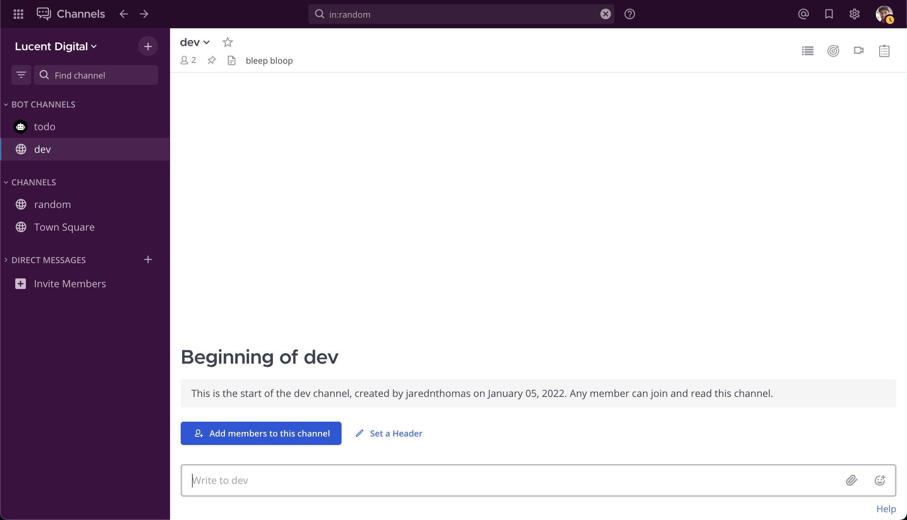
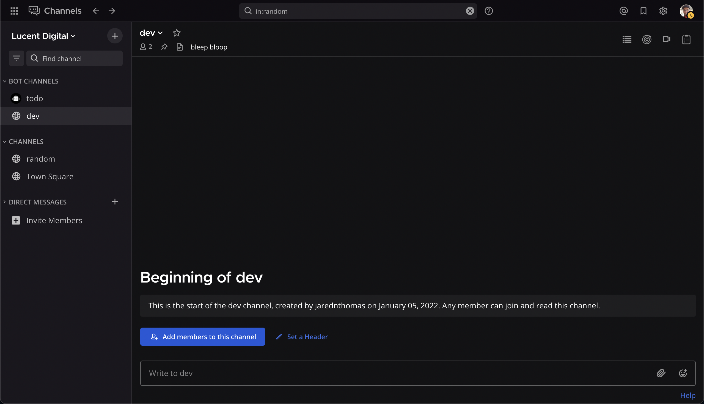
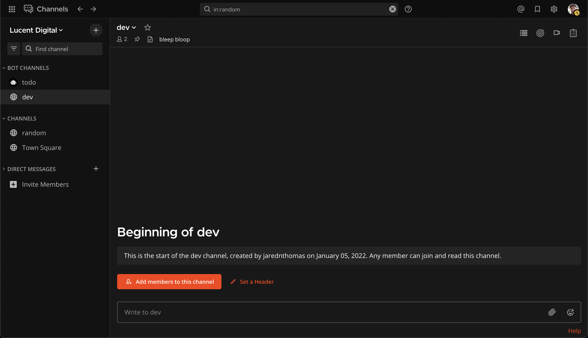
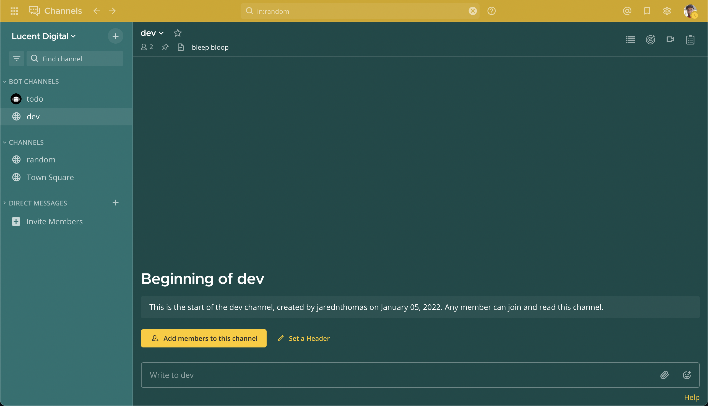
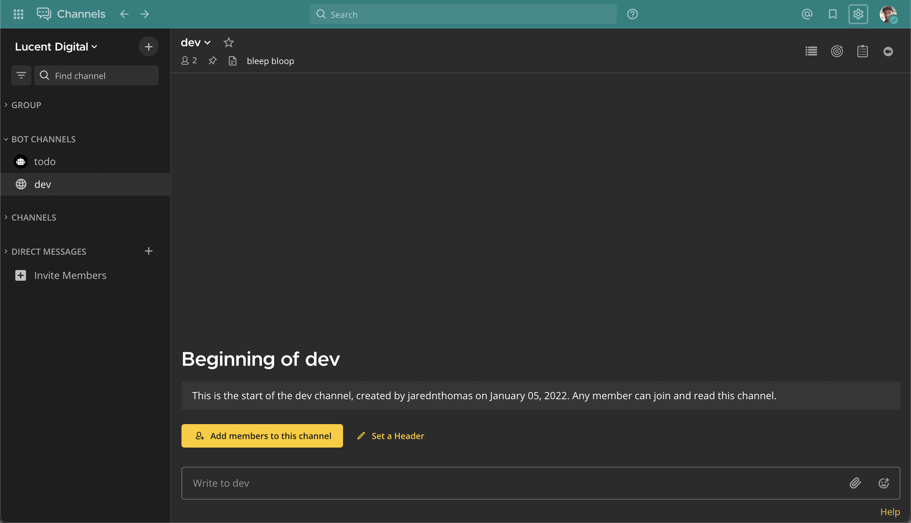

# mattermost-themes

### Instructions: 
- Click the Settings icon (gear) in the top right of the Mattermost UI

- Navigate to `Dislay` -> `Theme` and enable `Custom Theme`

- Paste any block of code below into the textarea labelled:
*"Copy and paste to share theme colors:"* and save

---

## Slack



```
{"codeTheme":"slack",
"centerChannelBg":"#ffffff",
"centerChannelColor":"#3f4350",
"sidebarBg":"#3f0e40",
"sidebarText":"#ffffff",
"sidebarTextHoverBg":"#350d36",
"sidebarUnreadText":"#ffffff",
"sidebarHeaderBg":"#350d36",
"sidebarHeaderTextColor":"#ffffff",
"sidebarTeamBarBg":"#2a0a2b",
"sidebarTextActiveBorder":"#1164a3",
"sidebarTextActiveColor":"#ffffff",
"mentionBg":"#cd2553",
"mentionBj":"#ffffff",
"mentionColor":"#1e325c",
"mentionHighlightBg":"#ffd470",
"mentionHighlightLink":"#1b1d22",
"buttonBg":"#1c58d9",
"buttonColor":"#ffffff",
"newMessageSeparator":"#cc8f00",
"onlineIndicator":"#2bac76",
"awayIndicator":"#ffbc1f",
"dndIndicator":"#d24b4e",
"linkColor":"#386fe5",
"errorTextColor":"#d24b4e"}
```

---

## Slack Dark


```
{"codeTheme":"slack-dark",
"centerChannelBg":"#121214",
"centerChannelColor":"#ffffff",
"sidebarBg":"#19171d",
"sidebarText":"#ffffff",
"sidebarTextHoverBg":"#231f29",
"sidebarUnreadText":"#d1d2d3",
"sidebarTeamBarBg":"#0e0c11",
"sidebarHeaderBg":"#121016",
"sidebarHeaderTextColor":"#ffffff",
"sidebarTextActiveBorder":"#1164a3",
"sidebarTextActiveColor":"#ffffff",
"mentionBg":"#cd2553",
"mentionBj":"#ffffff",
"mentionColor":"#1d82b8",
"mentionHighlightBg":"#ffd470",
"mentionHighlightLink":"#1b1d22",
"buttonBg":"#1c58d9",
"buttonColor":"#ffffff",
"newMessageSeparator":"#cc8f00",
"onlineIndicator":"#2bac76",
"awayIndicator":"#ffbc1f",
"dndIndicator":"#d24b4e",
"linkColor":"#386fe5",
"errorTextColor":"#d24b4e"}
```

---

## Spotify Orange


```
{"codeTheme":"spotify-orange",
"centerChannelBg":"#181818",
"centerChannelColor":"#ffffff",
"sidebarBg":"#121212",
"sidebarText":"#ffffff",
"sidebarTextHoverBg":"#fc3d03",
"sidebarUnreadText":"#ffffff",
"sidebarTeamBarBg":"#0e0e0e",
"sidebarHeaderBg":"#121212",
"sidebarHeaderTextColor":"#ffffff",
"sidebarTextActiveBorder":"#1bba56",
"sidebarTextActiveColor":"#1bba56",
"mentionBg":"#1c58d9",
"mentionBj":"#ffffff",
"mentionColor":"#ffffff",
"mentionHighlightBg":"#fc3d03",
"mentionHighlightLink":"#ffffff",
"buttonBg":"#fc3d03",
"buttonColor":"#ffffff",
"newMessageSeparator":"#fc3d03",
"onlineIndicator":"#1bba56",
"awayIndicator":"#e0b333",
"dndIndicator":"#fc3d03",
"linkColor":"#fc3d03",
"errorTextColor":"#f74344"}
```

---

## Lucent 



```
{"codeTheme":"lucent",
"centerChannelBg":"#cccccc",
"centerChannelColor":"#000000",
"sidebarBg":"#aaaaaa",
"sidebarText":"#000000",
"sidebarTextHoverBg":"#999999",
"sidebarUnreadText":"#ffffff",
"sidebarTeamBarBg":"#008080",
"sidebarHeaderBg":"#008080",
"sidebarHeaderTextColor":"#000000",
"sidebarTextActiveBorder":"#1bba56",
"sidebarTextActiveColor":"#1bba56",
"mentionBg":"#FFCA05",
"mentionBj":"#008080",
"mentionColor":"#ffffff",
"mentionHighlightBg":"#008080",
"mentionHighlightLink":"#ffffff",
"buttonBg":"#FFCA05",
"buttonColor":"#000000",
"newMessageSeparator":"#717171",
"onlineIndicator":"#1bba56",
"awayIndicator":"#FFCA04",
"dndIndicator":"#fc3d03",
"linkColor":"#008080",
"errorTextColor":"#f74344"}
```


---

## Lucent Dark 



```
{"codeTheme":"lucent-dark",
"centerChannelBg":"#2b2b2b",
"centerChannelColor":"#ffffff",
"sidebarBg":"#1e1e1e",
"sidebarText":"#ffffff",
"sidebarTextHoverBg":"#008080",
"sidebarUnreadText":"#ffffff",
"sidebarTeamBarBg":"#008080",
"sidebarHeaderBg":"#1e1e1e",
"sidebarHeaderTextColor":"#ffffff",
"sidebarTextActiveBorder":"#1bba56",
"sidebarTextActiveColor":"#1bba56",
"mentionBg":"#008080",
"mentionBj":"#008080",
"mentionColor":"#ffffff",
"mentionHighlightBg":"#008080",
"mentionHighlightLink":"#ffffff",
"buttonBg":"#008080",
"buttonColor":"#ffffff",
"newMessageSeparator":"#717171",
"onlineIndicator":"#1bba56",
"awayIndicator":"#FFCA04",
"dndIndicator":"#fc3d03",
"linkColor":"#FFCA05",
"errorTextColor":"#f74344"}
```

---

## Lucent Bold


```
{"codeTheme":"lucent-bold",
"centerChannelBg":"#134949",
"centerChannelColor":"#ffffff",
"sidebarBg":"#1e7171",
"sidebarText":"#ffffff",
"sidebarTextHoverBg":"#e6e6e6",
"sidebarUnreadText":"#ffffff",
"sidebarTeamBarBg":"#d2a500",
"sidebarHeaderBg":"#1e7171",
"sidebarHeaderTextColor":"#ffffff",
"sidebarTextActiveBorder":"#1bba56",
"sidebarTextActiveColor":"#1bba56",
"mentionBg":"#FFCA05",
"mentionBj":"#FFCA05",
"mentionColor":"#ffffff",
"mentionHighlightBg":"#1e7171",
"mentionHighlightLink":"#ffffff",
"buttonBg":"#FFCA05",
"buttonColor":"#313131",
"newMessageSeparator":"#313131",
"onlineIndicator":"#1bba56",
"awayIndicator":"#FFCA04",
"dndIndicator":"#fc3d03",
"linkColor":"#FFCA05",
"errorTextColor":"#f74344"}
```

---

More themes can be found at [https://avasconcelos114.github.io/mattermost-themes/](https://avasconcelos114.github.io/mattermost-themes/)